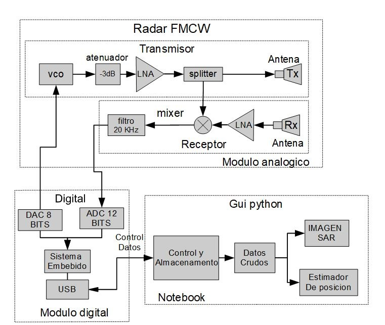
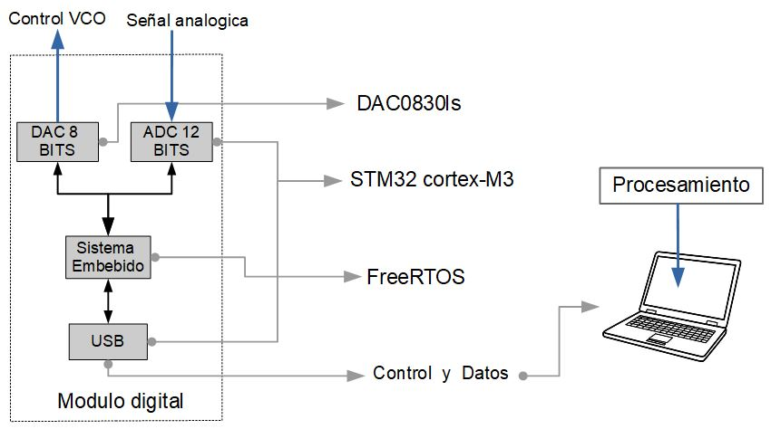

### Diagrama en bloques del radar Digital

### Control Digital del radar 

### Conversor digital DAC-8 BITS
- [Dac0830](https://pdf1.alldatasheet.com/datasheet-pdf/view/517553/TI/DAC0830LCN.html)

### Microcontrolador STM32 BluePill
- [STM32](https://stm32-base.org/boards/STM32F103C8T6-Blue-Pill.html)

### Sistema Embebido

### Comuninicacion USB

